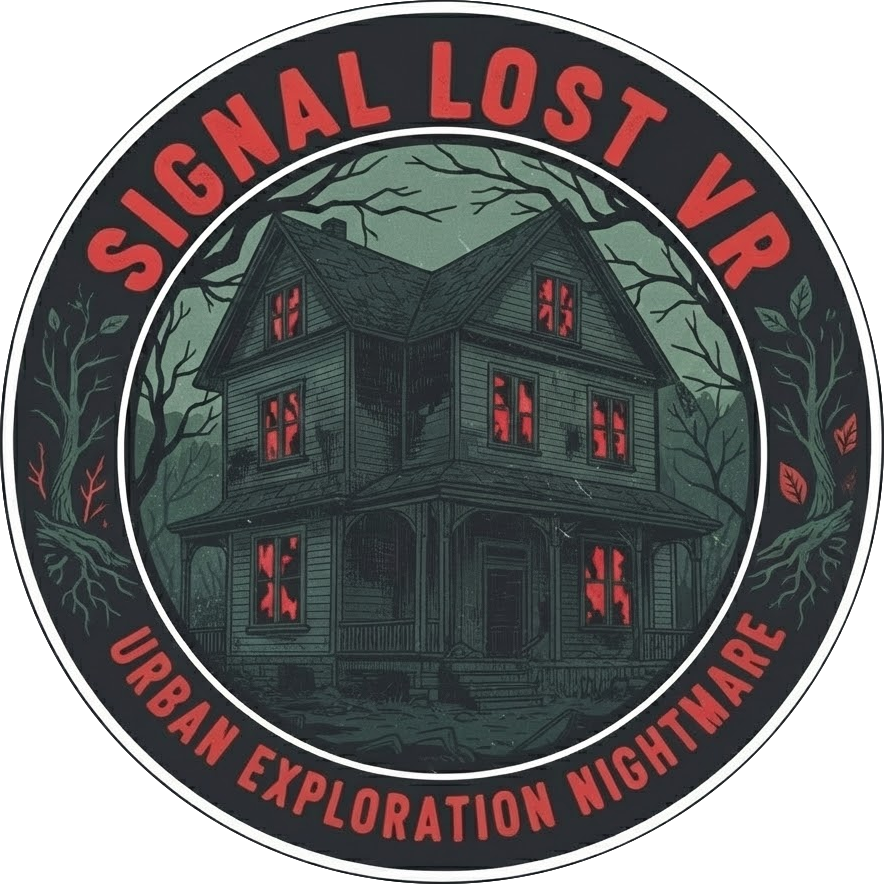
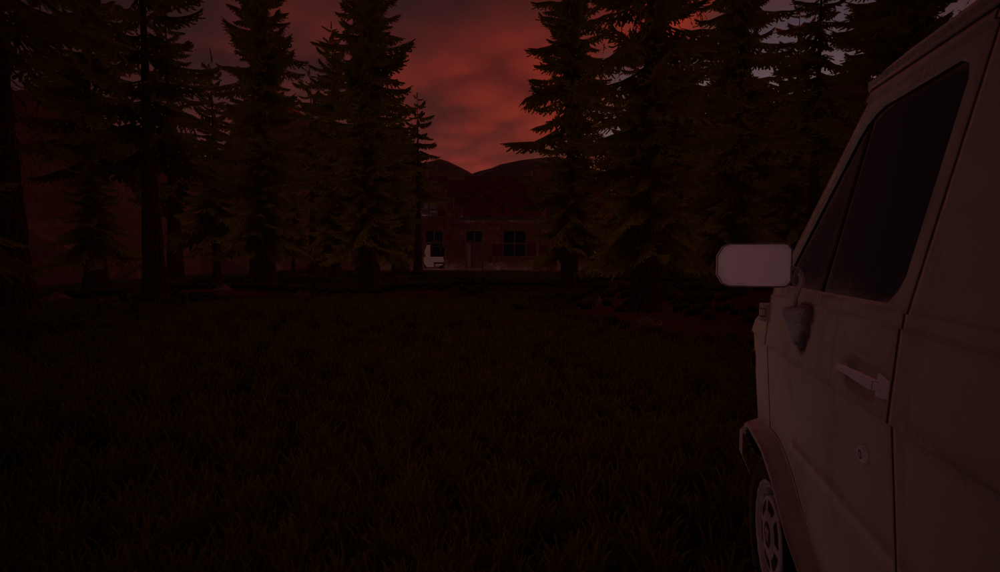
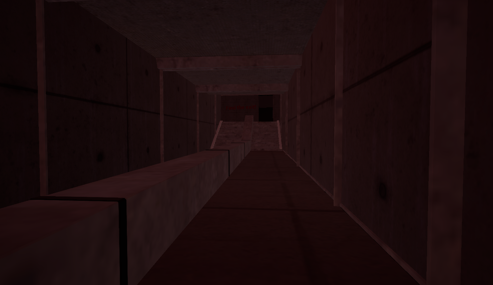
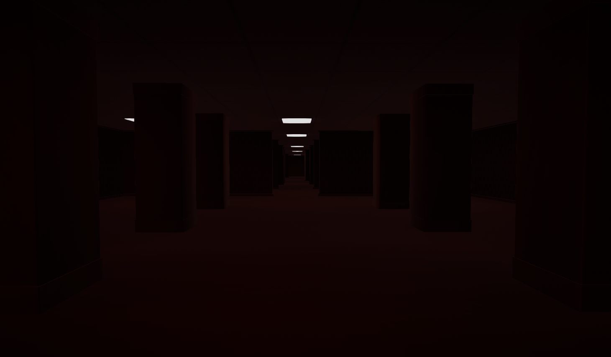
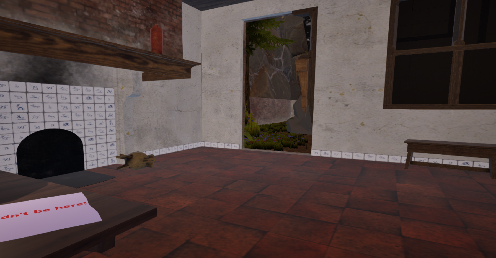

 
    

# SIGNAL LOST VR

**Genre**: VR game / Exploration / Horror  
**Platform**: VR (Meta Quest)  
**Engine**: Unreal Engine 5  
**Language**: French  
**Type**: Academic project

## Description

SIGNAL LOST VR is a virtual reality survival horror experience developed using Unreal Engine 5. The player takes on the role of a videographer specializing in urban exploration (urbex), who has come to film a report in an abandoned house known for its oppressive atmosphere.

During the exploration, reality shifts. The player finds themselves trapped in an alternate dimension inspired by the “Backrooms”: labyrinthine, unstable, and dangerous spaces.

The goal is to understand the tragic events linked to the house and survive the hostile entities to find a way out.

The experience emphasizes:

- Immersion in virtual reality.
- Psychological tension and soundscape.
- Environmental storytelling.
- Escape and survival mechanics.

## Technologies

- **Engine**: Unreal Engine 5
- **Scripting**: Blueprints
- **VR**: OpenXR, Meta Link
- **Tools**: Android Studio Flamingo (for Quest deployment)

## Technical Requirements

The requirements for creating the project were:

- **Engine:** Unreal Engine 5 (version 5.4.4 recommended).
- **SDK:** Android Studio (configured with NDK and JDK for Unreal).
- **Hardware:** Meta Quest 3 headset and a USB-C data transfer cable (Link Cable).
- **Meta Account:** Developer Mode enabled.

## Meta Quest 3 Deployment Guide

Here is the procedure for installing and launching the application on the headset.

### 1. Headset Configuration (Developer Mode)

First, the headset must be ready to receive unofficial applications:

1.  Open the **Meta Quest** application on your smartphone.
2.  Go to **Menu > Devices > Headset Settings > Developer Mode**.
3.  Enable the **Developer Mode** switch.
4.  Connect the headset to your PC via USB-C. In the headset, accept the _“Allow USB Debugging”_ window.

### . Installing the APK (Final Version / Rendering)

To install the game permanently:

**A. Packaging (Creating the file)**

1.  In Unreal Engine, go to **Platforms > Android**.
2.  Select **Package Project**.
3.  Choose a destination folder on your PC.
4.  Wait for the compilation to finish (“Build Successful”).

**B. Installation on the headset**

1.  Open the folder where the project was packaged.
2.  You will find a `.command` file named `Install_Finalmap-arm64.command`.
3.  Connect the headset via USB (make sure it is turned on).
4.  Double-click on the **`.command`** file. A command window will open and install the APK on the headset.

**C. Launching the application**

1.  Put on the headset.
2.  Go to the **Application Library**.
3.  Click on the search bar or filter at the top right and select **Unknown Sources**.
4.  Your project will appear in the list. Click to play!

## Development Team

This project was carried out by a team of 5 people:

- **Thomas CORDE**: Game Design, Level Design, Gameplay Development (Blueprints), VR & Interactions
- **David JUDEA**: Game Design, Level Design, Environments, 3D, Lighting, Sound, Testing
- **Yassine FALIL**: VR & Interactions, Environments, 3D, Lighting, Testing
- **Andrea GUEZO-TAVARES**: 3D, Lighting, Sound, Testing
- **Sarah OSMANI**: Sound, Presentation

---

_Project realized for the Introduction to virtual reality module - ETNA._

### Gallery :

---

 
    

---

 
    

---

 
    

---

 
    

